# 11월 4째주

`<b style="background: skyblue"></b>`

## 📌 2019-11-18 Mon

### 📑 Todo_List

* SW-Engineering Team project 소스 개선
  - [x] 모바일 뷰 개선
  - [x] 인스타그램 미리보기 기능 구현

### 📝 Today_Learned

#### <b style="background: skyblue">Javascript event</b>

* *object*.addEventListener(<b style="background:yellow">"mousedown"</b>, *myScript*);
  * 해당 component(=object) 위에서 마우스를 눌렀을때를 감지하는 event다.
* *object*.addEventListener(<b style="background:yellow">"mouseup"</b>, *myScript*);
  - 해당 component(=object) 위에서 마우스를 눌렀다가 땟을때를 감지하는 event다.
* *object*.addEventListener(<b style="background:yellow">"touchstart"</b>, *myScript*);
  * 해당 component(=object) 위에서 손가락으로 눌렀을때(터치했을때)를 감지하는 event다.
* *object*.addEventListener(<b style="background:yellow">"touchend"</b>, *myScript*);
  - 해당 component(=object) 위에서 손가락으로 눌렀다 땟을때를 감지하는 event다.


#### <b style="background: skyblue"> 🐱‍👤Computer Graphics</b>

**3차원 그래픽스 처리 관련 키워드 정리** 

* Translate `위치변환`
* Rotate `회전변환`
* Scale `크기변환`
* modeling `모델링`
* Rendering `렌더링`
* viewing `물체를 바라다 보는것`
* 가시부피 `3차원 공간에서 바라보았을 때의 공간`

* 


**투영=투상 (Projection)**

* 3차원 객체를 2차원 출력장치에 맵핑하는 작업


* **투영 = 가시변환** 

* **투영의 종류**
  * 평행투영 (Patallel)
    * glOrtho( )
  * 원근투영 (Perspective)
    * glPerspective( )


**축측 투영( Axonometric Projection )**

* x,y,z 세 좌표축이 서로 이루는 각도가 모두 같거나 둘만 같거나 모두 다른 특성을 가지는 투영방법이다.

* 직교투영은 투영면이 축과 직각 방향이었지만 축측투영에서는 투영면이 축과 직각이 아닌 방향으로 위치하고 있다.

* 정육면체를 모서리에서 반대쪽 모서리를 행해서 보는 것과 같으며 게임 분야에서는 복잡한 3D 계산을 하지 않고 2D 그래픽만으로 3차원 환경을 쉽게 표현할 수 있으나 원근감을 고려하지 않아 착시현상을 일으키기 쉽다.

* 축측 투영은 x, y, z 세 좌표축이 서로 이루는 각도에 따라 `등각 투영(Isometric Projection)`, `이등각 투영(Dimetric Projection)`, `부등각 투영( Trimetric Projection)`으로 나눌 수 있다. 등각 투영을 2D 전략시뮬레이션 또는 RPG게임에서 광활한 지형을 표현할 때 이용한다.


**원근 투영( Perspective Projection )**

* 시점에서 멀리 떨어져 있는 객체는 작게 투영되고 가까이 있는 객체는 상대적으로 크게 투여이 되어 사람의 눈으로 3차원 사물을 보듯이 보다 현실감 있는 투영 결과를 얻을 수 있는 투영 방법이다.

* 평행 투여오가는 달리 투영선들이 평행을 이루지 않는다. 따라서 투영면에 직각 방향으로 투영이 되지 않는다.

* 평행 투영에서는 투영 방향만 설정하면 되지만 원근 투영에서는 하나의 시점에서 3차원 객체를 바라본 모습이 3차원 투영면에 나타나므로 모튼 투영선이 시점에 모이게 된다.

* 원근 투영은 `소실점( Vanish Point )` 수에 따라 **1점 투영, 2점 투영, 3점 투영** 등으로 나뉘며 이중 1점 투영은 게임에서 많이 이용하는데 1점 투영을 이용해야 물체의 3차원 깊이가 증가함에 따라 투영의 크기가 줄어드는 현상을 나타낼 수 있다.


**소실점( Vanishing Point )**

* 시각 평행선들이 무한이 멀리 있는 하나 또는 여러개의 점으로 모여지는 것을 말한다. 즉 물체의 연장선을 그었을 때 선과 선이 만나는 점을 소실점이라 한다.


**관찰자 위치** 

​	= 카메라 위치 
​	= 투상중심(Center Of Projection)
​	= 시점좌표계 원점


-----------

**카메라의 좌표계 표현**


* <b style="background: yellow">gluLookAt(eyex, eyey, eyez, atx, aty, atz, upx, upy, upz);</b>

* <b style="background: yellow">투상 : void glMatirixMode(GL PROJECTION);</b>

* **가시부피** 
  * 장면의 범위를 지정할 필요성
  * 아래의 두개가 지정이 되면 volume이 지정됩니다.
    * **전방 절단면**
    * **후방 절단면**


-----------------

**Orthographic viewing volume**


**Perspective Projection**


```c++
gluPerspective( 
    GLdouble fovy,     // angle of view 시야각
	GLdouble aspect, // width / height 종횡비
	GLdouble zNear,  // depth of front clip. plane 전방절단면
	GLdouble zFar
    );   // depth of back clip. plane 후방절단면

```

```c++
void glFrustrum(
	Gldouble left,
    Gldouble right,
    Gldouble botttom,
    Gldouble top,
    Gldouble near,
    Gldouble far
)
```


* **<b style="background: pink">정규화 가시부피</b>**
  * 가로, 세로, 높이가 2인 정육면체로 투상
  * 정규화 변환
  * **이유**
    * 평행투상, 원근투상을 동일한 모습의 정규화 가시부피로 변형
    * <b style="background: pink">정육면체를 기준으로 하면 연산이 간단함.</b>
    * 다양한 해상도의 화면 좌표계로 변환하기가 간단함.


---------------

**지엘 파이프라인**


--------------------

**렌더링 (Rendering)**

* 은면제거, 쉐이딩, 텍스쳐 매핑

* 와이어 프레임
  * 드로잉 속도가 빠르다.
  * 가끔씩 솔리드 렌더링으로 외형 확인
* **어파인 공간**
  * 벡터와 벡터의 덧셈 ( 뺄셈 )
  * 스칼라와 벡터의 곱셈 ( 나눗셈 )
  * 점과 벡터의 덧셈 ( 뺄셈 )

## 📌 2019-11-19 Tue

### 📑 Todo_List

- [x] 그래픽스 9장까지 공부
- [ ] Software Engineering 복습
- [x] 자기소개서 작성
- [ ] 인공지능 과제
- [ ] goorm develup 과제 

### 📝 Today_Learned

#### <b style="background: skyblue">🐱‍👤 Computer Graphics</b>

**어파인 공간 affine space**


위 그림에서 점Q에서 점P를 빼면 P에서 Q를 향하는 벡터 V가 된다.
즉, V=Q-P이다. 이것은 Q=V+P로 표현될 수 있고, 이것은 우변은 점 P와 벡터 V의 합이 된다.

**어파인 공간**이란, 이처럼 점을 마치 벡터처럼 취급함으로써 벡터 공간을 확장한 것이다.

어파인 공간에서는 3가지의 연산이 가능하다.

- 벡터와 벡터의 덧셈 ( 뺄셈 )
- 스칼라와 벡터의 곱셈 ( 나눗셈 )
- 점과 벡터의 덧셈 ( 뺄셈 )

-------

**그래픽 변환의종류**


* **강체변환**
  * **이동변환, 회전변환**
  * 물체 자체의 모습은 불변

* **유사변환**

  * **강체변환 + 균등 크기조절 변환, 반사변환**
  * 물체면 사이의 각이 유지됨
  * 물체내부 정점간의 거리가 일정한 비율로 유지됨

* **어파인변환**

  * **유사변환 + 차등 크기조절 변환, 전단변환**
  * 물체의 타입이 유지
    * 직선은 직선으로, 다각형은 다각형으로, 곡면은 곡면으로
    * 평행선이 보존
    * 변환행렬의 마지막 행이 항상 (0,0,0,1)

* **원근변환**

  * 평행선이 만남
  * 직선이 직선으로 유지
  * 변환행렬의 마지막 행이 (0,0,0,1)이 아님

* **선형변환**

  * 어파인 변환 + 원근 변환

  * x' = ax + by + cz

----------------

**모델링**

* 물체를 설계 ( = 물체 정점을 정의 )

**모델 좌표계**

**지역 좌표계**

* **전역 좌표계** : 일률적으로 어우를 수 있는 기준 좌표계 (게임에서의 배경)

**장면** 

* 여러 물체가 존재 ( = 여러 지역 좌표계가 존재 )

**시점변환( = 뷰변환 )**

* 카메라 위치와 방향 설정
* 뷰행렬로 대변됨
* 전역좌표에 뷰행렬을 곱하면 시점좌표
  * **시점좌표계**
    * 물체를 바라다보는 위치

**모델변환**

* 물체에 가해지는 기하변환
* 모델 행렬로 대변됨
* 모델 좌표에 모델 행렬을 곱하면 전역좌표

------------

**행렬모드 설정**

```c++
void glMatirixMode(Glenum mode);
// GL_MODELVIEW
// GL_PROJECTION
// GL_TEXTURE
```

**초기화**

```c++
void glLoadIdentity(); // 항등행렬로 초기화
// 초기화 결과 : 모델 좌표계 -> 전역좌표계 -> 시점 좌표계
```

**기하변환**

```c++
void glTranslatef(GLfloat dx, GLfloat dy, GLfloat dz);
void glScalef(GLfloat sx, GLfloat sy, GLfloat sz);
void glRotatef(GLfloat angle, GLfloat x, GLfloat y, GLfloat z);
```

**함수호출 순서**

glLoadIdentity ➡ glRotatef ➡ glTranslatef ➡ glVertex3f


**시점 좌표계**

```c++
void gluLootAt(
    // 카메라의 위치
	GLdouble eyex,
    GLdouble eyey,
    GLdouble eyez,
	// 카메라가 바라보는 점, 즉 초점의 위치
    GLdouble atx,
    GLdouble aty,
    GLdouble atz,
	// 카메라의 기울임
    GLdouble upx,
    GLdouble upy,
    GLdouble upz
)
```


-----------

**은면 Hidden Surface**

* 시점에서 보이지 않는 면을 제거

**은면제거의 목적**

* 실감있는 이미지를 표현하고, 
  렌더링 처리시간을 단축하여 처리속도의 증대


**벡터**


* **내적 (Dot product)**


* **외적 (Cross product)**

  S X t  =  -t X S


**평면 표현**


-----------

**지엘의 후면제거**

```c++
glEnable(GL_CULL_FACE); // 후면 제거모드 활성화

glCullFace(GL_FRONT); // 실제 후면 제거작업
```

**하나의 면**

*  = 표면(외부) + 이면(내부)

**표면**

```c++
glFrontFace(GL_CW); // 시계방향으로 정의된 면

glFrontFace(GL_CCW); // 반시계방향으로 정의된 면
```

-------------------


**절단(Clipping)**

* 2차원 절단 - 코헨 써더랜드방법
* 3차원 절단
  * 가시부피 이용
* 절단 다각형

**정점의 내외부 판정**

* 두 Vector를 Dot Product한 결과가 양수면 외부, 음수면 내부


**은면제거 알고리즘**


* **객체 공간법**
  * 공간상 객체의 위치관계를 이용하여 은면 결정
    * 공간상의 객체의 위치관계 이용
    * 객체가 적거나 분산되어 존재할 때 가장 효율적
    * 객체가 많아질 경우 은면제거 계산이 복잡
  * 깊이 정렬 알고리즘 등...
* **이미지 공간법**
  * 투영된 픽셀평면에서 객체가 보이는지 여부를 검사
    - **투영면에서 객체의 가시성 여부를 이용**
    - 투영면의 해상도에 따라 처리속도가 좌우
    - 투영면의 각픽셀에 투영되는 객체에 대한 정보를 필요로 하므로 **많은 메모리가 요구**된다.
  * z-버퍼 알고리즘 등


------------


**곡선**

* 알아야할 내용
  * "**베지어 곡선**"과 "**스플라인 곡선**"
  * "**스위핑기법**"
  * "**프랙탈 기하학**"
* 객체 모델링의 개요
  * 다각형면과 2차 곡면을 이용하여 3차원 객체 표현

**삼각형 메쉬**

* 1차 방정식으로 표현됨
* 렌더링이 간단
* **랜덤한 정보에 대하여 가장 많이 사용이 되어진다.**

**사각형 메쉬**

* 보통 2개의 삼각형으로 분할하여 처리

* 또는 평면 방정식을 근사적으로 계산
  * **Ax + By + Cz + D = 0**
  * Ax + By + Cz + D < 0 : **평면의 안쪽**
  * Ax + By + Cz + D > 0 : **평면의 밖쪽**
* **점들이 균일하게 배열되어 있으면 사각형이 적합**

**다면체의 기하적인 정보 표현**

* **꼭지점 표, 모서리 표, 다각형 표**
* **일관성**과 **완전성**이 유지 되어야 함


**커브와 표면 재표현**

* 명시적 방법
* 함축적 방법
* 매개변수 방법


**매개변수 표현방법의 특징**

* 커브가 유연하다.
* 함수로 표현할 필요가 없다.
* 표면에 경우 parameter가 1개가 아니라 2개를 사용한다.


**파라미터 표현**

* **정규화 파라미터**
  * 파라미터의 범위가 (0<=t<=1)

-----------------

**스플라인 곡선**

* 스플라인 = 구간별 다항식으로 구성

* 부드러운 곡선의 모양을 다항식으로 표현
  * 베지어, 비-스플라인
  * 제어점을 지정하여 곡선의 형태를 생성

* **보간곡선과 근사곡선**
  * **보간 :** 주어진 제어점을 통과
  * **근사 :** 제어점을 연결하는 선의 모양에 근사


**스플라인 관련 용어**

* Control Points (제어점)
  * 커브에 영향을 미치는 점의 집합
* InterPolating spline (근사)
  * 제어점 통과 X
  * 부드러움을 위해 제어점을 통과하지 않음
  * 제어점은 곡선을 끌어당기는 역할
* Approximating spline (보간)
  * 제어점 통과 O

**스플라인 정의**

* 구간별로 Curve를 만들어야 함
* 2차 미분값이 같아야 한다.
* 일관적으로 적용되어야 한다.(안정성)
* 랜더링하기 쉬워야 한다


**스플라인의 지역성**

* **직역성(Locality)**
  * 제어점을 움직일 때 여타 구간에 미치는 영향력
  * **이미 설계완료 된 부분에 영향을 미치지 않도록 작을수록 좋음**
  * **구간별로 서로 다른 계수의 다항식**
    * 지역성 향상을 위함

* **곡선의 국부제어**
  * 제어점 하나가 바뀔 때


* 볼록다각형 내포성
  * 곡선은 항상 Convex Hull 내에 포함된다.
  * 곡선의 개괄적인 모양을 파악, 곡선 클리핑에도 이용


**스플라인의 연속성**

* 곡선의 부드러움
  * 제어점 부근에서의 곡선의 기울기와 곡률에 따라 달라진다.
  * 불연속
* C1연속
  * 들어오는 기울기 = 나가는 기울기. 
    기울기 = 접선 = 1차 미분계수
* G1연속
  * 기하학적 또는 시각적 연속성
  * 나가는 기울기가 들어오는 기울기의 상수배, 방향만 같음
* C2연속
  * **들어오는 기울기의 변화율**(= 곡률, 기울기의 기울기, 2차미분계수)
    **= 나가는 기울기의 변화율**.
    가장 부드러운 곡선.
    이를 위해 제어점을 피해갈 수 있음 = **근사 스플라인**

**스플라인 곡선과 연속성**

* 분할된 곡선을 연결하여 하나의 긴 곡선을 설계할 때
* 연결되는 지점에 다양한 연결 조건
  * **C0 연속성**
    * **두 곡선이 단순히 연결**
    * 양쪽 곡선의 좌표값이 동일
  * **C1 연속성**
    * **곡선의 기울기가 동일**
    * 즉, 1차 도함수가 동일
  * **C2 연속성**
    * **양쪽 곡선의 곡률이 동일**
    * 1차 및 2차 도함수가 동일


## 📌 2019-11-20 Wed

### 📑 Todo_List

- [ ] 그래픽스 9장까지 공부
- [ ] Computer Network Tutoring
- [ ] Software Engineering 복습
- [ ] 자기소개서 완성
- [ ] goorm develup 과제 

### 📝 Today_Learned

#### 🐱‍👤SE

😃 **확실성과 보안성**

배경 

- 현대인의 삶이 컴퓨터 시스템에 매우 의존적이다. 

- 의존도가 높을 수록 장애로 인해 피해도 커진다

- - 금전적 손실, 명성추락, 환경적 손실, 인명손실

- 피해를 줄이기 위해서는

- - 약속된 기능을 제공해야 한다.(1장 목표)
  - 확실해야 한다.(dependable) (2장 목표)
  - 관리를 잘해야 한다. (3장 목표)
  - 등등 수없이 많다.

| RAMS (시스템 분야) | Dependability (SW)(⭐ 책 292.p) |
| ------------------ | ------------------------------ |
| Reliability        | 가용성                         |
| Availability       | 신뢰성                         |
| Maintainability    | 안전성                         |
| Safety             | 보안성                         |
|                    | 복원성                         |

**😎확실성있는 시스템**

📜**시스템 확실성의 개념**

- 가장 중요한 속성

- - dependenability

- 사용자의 신뢰 정도

- - The User;s degree of Trust
  - The User’s Confidence

- 주요 확실성 속성

- - 가용성
  - 신뢰성
  - 아전성
  - 보안성
  - 복원성

📜**확실성의 중요성 (⭐ 책 292.p)**

- **장애는** 많은 사람에게 영향을 미침 

- - widespread effects

- 확실성이 없으면 ,사용자가 시스템을 거부함

- - rejected 

- 시스템 장애 비용이 막대함

- - 실패가 경제적 손실을 이끌거나 물리적 피해를 이끈다면 실패에 대한 비용손실은 아마도 클것이다. 

- 확실성이없는 시스템은 정보손실을 초래할 수 있다.


📜**장애의 원인 (⭐ 책 293.p)**

- 하드웨어 장애

- - 랜덤하게 발생
  - 항상 하드웨어가 정상 동작하는지 확인이 필요하다

- 소프트웨어 장애

- - 명세화, 설계, 혹은 구현시의 실수 때문에 시스템 소프트웨어 장애가 발생한다.
  - 설계는 첫 단추가 중요하다 

- 운영 시의 장애

- - 설계자가 의도한 대로 시스템을 사용하지 않거나 운영하지 않아서 장애가 발생
  - 사람 실수로 발생 
  - 사람이 SW를 쓰기 때문에 실수가 발생할 수 있다.


✅**중대한 시스템이란? (critical system)  -> 확실성 있게 개발해야한다**

- 시스템 장애가 치명적 손실을 초래한다.
- 장애가 매우 드물게 발생하도록 개발되어야 한다
- 장애 발생시 복구 매커니즘을 포함해야 한다.


📣 | Zero-defect : 무결점 시스템

✅📌**중대한 시스템의 예** 

- Safety critical system

- - 예시 )

  - - 원자력 발전제어 시스템
    - 자율주행 시스템

  - 장애로인해서 사람에게 큰 위험 가능성

- mission critical system

- - 장애가 발생하면 중대한 임무를 수행하지 못함 

- Business critical system

- - 장애가 발생하면 업무 비지니스에 막대한 영향

📣 | 장애가 발생하면 빠르게 복구가 가능해야한다.

📌📣 |오늘은 5가지 특성을 확실히 알아가는것 

| 📌Dependability (SW)(⭐ 책 292.p) |                                                              |                                                              |
| ------------------------------- | ------------------------------------------------------------ | ------------------------------------------------------------ |
| 가용성 Availability             | 수치적으로 나타낸다.(%)  서비스를 제공할 확률                | 시스템이 서비스를 요청받았을 때 해당 서비스를 제공할 수 있는 능력 |
| 신뢰성 Reliability              | 시스템이 명세화된 대로 서비스를 제공할 수 있는 능력          |                                                              |
| 안전성 Safety                   | 📣 내부적인것(내부의 침입) 에 대해서 단속   📘 치명적인 장애로 발전하지않게 대체할 수 있는 능력 |                                                              |
| 보안성Security                  | 📣 외부의 침입에대해서 시스템을 보호할 수 있는 능력  📘 시스템이 의도적 혹은 우연적 침입을 막아낼 수 있는 능력 |                                                              |
| 복원성Resilience                | 📣 장애가 발생되었을 때 시스템을 원래 상태로 복구시킬 수 있는 능력  📘 시스템이 손상 사건에 견디고 복원할 수 있는 능력 |                                                              |

| 📣 교수님 추가 말씀                                           |
| ------------------------------------------------------------ |
| SIL 이란? → 안전 무결성 기준 인증기관에 system의 safty case를 제출하면 sil 등급을 매겨 안전 인증서를 발급한다안전 무결성 수준은 안전 기능에 의해 제공되는 상대적 위험 감소 수준으로 정의되거나 목표 위험 감소 수준간단히 말해 SIL은 안전 계측 기능에 필요한 성능을 측정하는 것 <br />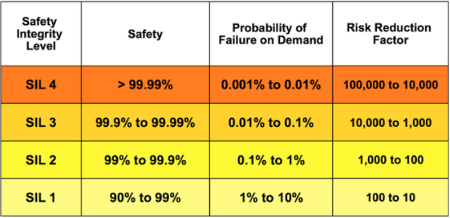<br />CC 인증<https://m.blog.naver.com/kebinj/40102557431> 보안성에서 사용Common Criteria( 공통기준 )1~7단계가 있음 |


✅**속성간의 관계(💡책에없는 내용)**

- 안전성을 가용성과 신뢰성에 의존 

- 외부 공격을 당하면 시스템을 신뢰할 수 없음

- DOS공격은 가용성을 손상하는 것이 목적임

- 바이러스에 감염되면, 신뢰성과 안전성을 확신할 수 없음

📜**확실성 달성을 위한 점검 사항**

- 우발적 오류를 피한다 
- V&V  프로세스를 갖춘다
- 결함 내성을 갖도록 설계한다 (건물의 내진 설계와 유사)
- 보호 매커니즘을 설계한다
- 설정을 정확히 한다
- 공격에 저항해야 한다.
- 신속히 복구되도록 설계한다.

📜**결함내성 (⭐ 297.p)**

확실성 있는 시스템이 자신을 모니터링하고, 잘못된 상태를 감지하고, 장애가 발생하기 전에 결함으로부터 복구하기 위한 여분의 코드를 포함해야 한다는것을 의미

- MooN (M out of N)

- 1oo2 (1 out of 2)

- 1oo3 (1 out of 3)

- 2oo3 (2 out of 3)


📜**시스템과 소프트웨어**

- 소프트웨어 공학은 고립된 활동이 아니다.

- - 📣 | 만들고자 하는 SW의 주변 환경에 대한 이해가 필요하다.

- 고립된 시스템이 아니라 인간적, 사회적,조직적, 목적을 갖는 더 광범위한 시스템의 일부이다.

- - 사회의 일부가 된다.

✅📌**사회 기술적 시스템 스택 (⭐ 299.p)**

📣| 기말 시험에 냈던거야~

- 광범위한 시스템을 사회기술적 시스템이라고 함.

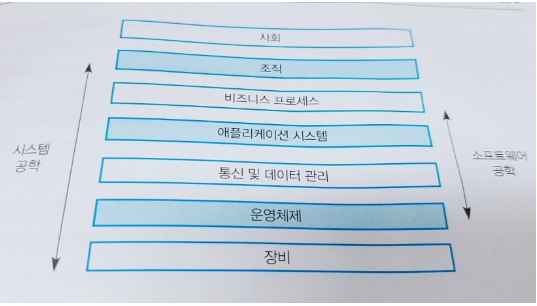 

그림 | 📖 책 299p.

| 📖 책 298p.                                                   |
| ------------------------------------------------------------ |
| 사회기술적 시스템은 컴퓨터, 소프트웨어,기타 장비와 같은 기술적 구성 요소뿐만 아니라 사람, 프로세스, 규정과 같은 비기술적 요소를 포함한다. |

📜**규정과 준수 (Regulation and Compliance)**

📖 301.p | 안전성 중심 시스템을 개발하는 기업은 인증을 받기 위해 규칙과 규정을 준수한다.

✅**규제 받는 시스템**

- 대부분의 중대한 시스템은 규제 시스템이며 승인 받아야함

- - 예시 )

  - - 원자력 시스템
    - 항공제어 시스템
    - 의료 장비

✅**안전성 규제**

- 규제와 준수는 시스템 전체에 대해서 적용됨

- 안전 관련된 시스템 인증을 받아야 함

- 인증서를 얻기 위해서, Safety case를 작성

- - (📖 301.p )
    📣 시스템이 인증기관에 인증요청을 할때 제출하는 것이 Safety case이다.

  - - 책에서는 이것을 안전성 사례라고 소개가 되어 있다.
    - 📣 안정성사례 → 종합 안전 대책 보고서 

- 인증을 위한 문서화는 비용이 크다.

- - 인증을 위한 문서를 개발하는 것이 시스템 자체를 개발하는 것 만큼 비용이 많이 들 수 있다.

📜**다양성과 중복성 (⭐ 301.p)**

- Redundancy 중복성

- - 시스템의 일부가 실패할 경우에 사용될 수 있는 여분의 기능을 시스템에 포함하는것
  - 📣 중복 : 백업서버를 여러개 둘 수 있다.

- Diversity 다양성

- - 시스템의 중복된 컴포넌트들을 서로 다른 종류로 하여 동일한 방식으로 실패하지 않을 확률을 높이는것
  - 📣 다양성 : 외부 침입자에대해 방어하기 위해 다양한 운영체제를 사용


----------

**📜확실성이 있는 프로세스 (⭐ 304.p)**

홧츠 험프리 曰  sw 개발 프로세스의 질이 sw 제품의 질을 좌우한다.

| 📖 책 304p                                                    |
| ------------------------------------------------------------ |
| 확실성 있는 소프트웨어 프로세스는 확실성 있는 소프트웨어를 생산하도록 설계된 소프트웨어 프로세스이다. 다양성과 중복성은 확실성이 있는 소프트웨어 개발 프로세스의 설계에도 사용가능하다. 좋은 소프트웨어 프로세스가 적은 오류를 포함하여 실행 시에 장애 발생이 적은 소프트웨어로 이어질 가능성이 높다. |

- 장애없는 소프트웨어를 예방하는 것이 중요하다. 

- 📖 304.p | 명시적으로 정의된 프로세스는 소프트웨어 생산 프로세스를 구동하는 데 사용되는 정의된 프로세스 모델을 가진다.

- 반복가능한 소프트웨어를 사용해야한다.

- -  📖 305.p | 반복 가능한 프로세스는 개인의 해석과 판단에 의존하지 않는다	

📜**확실성이 있는 프로세스에 포함되는 활동들**

| 요구사항 검토             | 요구사항이 가능한 완전하고 일관성 있는지 검토                |
| ------------------------- | ------------------------------------------------------------ |
| 요구사항 관리             | 요구사항의 변경이 통제되는 것과 제안된 요구사항 변경의 영향이 그 영향을 받는 모든 개발자에 의해 이해되는 것을 보장 |
| 정형명세                  | 소프트웨어의 수학적 모델을 생성하고 분석한다. 10.5 절에서 정형 명세 장점을 설명한다. 아마도 이것의 가장 중요한 장점은 시스템 요구 사항의 매우 상 세한 분석을 강제한다는 것이다.이 분석 자체는 요구 사항 검토에서 누락되었을 수있는 요구 사항 문제를 발견해 낼 가능성이 높다. |
| 시스템 모델링             | 소프트웨어 설계가 일련의 그래픽 모델로 명시적으로 문서화 되고, 요구사항과 이들 모델 사이의 관계가 명시적으로 문서화 된다. |
| 설계 및 프로그램 인스펙션 | 시스템의 다른 표현들이 다른 사람들에 의해 검사되고 점검된다. |
| 정적 분석                 | 자동화된 검사가 프로그램의 소스 코드에 대해 수행된다.        |
| 테스트 계획 수립 및 관리  | 시스템 테스트의 포괄적인 집합이 설계된다.                    |

😎**신뢰성 공학**

**📜신뢰성 VS 비용**

- 신뢰성을 높일수록, 비용도 증가한다.

- - 적정선을 찾는것이 중요하다.

용어

- 브라이언-란델의 사고 모델

- - Chain of events

  - - 결함 (fault) -> 오류(error)  -> 고장(failure) → 사고 → 사망

  - 욕심이 잉태한즉 죄를 낳고, 죄가 장성한즉

📜📌**Fault management (⭐ 317.p)**

 📣 | 시험에도 꼭나오는 부분이야~

- 고장을 줄이는 방법

- - 결함회피
  - 결함 감지 및 정정
  - 결함내성

| 📖 책 317~318p                                                |                                                              |
| ------------------------------------------------------------ | ------------------------------------------------------------ |
| 결함회피                                                     | 소프트웨어 설계 및 구현 프로세스는 설계 및 프로그래밍 오류를 피하는 소프트웨어 개발 방식을 사용하여 시스템에 도입되는 결함을 최소화해야한다. 적은 결함은 실행 중에 장애가 적다는 것을 의미한다. 결함 회피 기법은 광범위한 컴파일러 검사를 허용하는 강한 자료형의 언어 사용과 포인터와 같이 오류가 발생하 기 쉬운 언어 구성 요소의 사용을 최소화하는 것을 포함한다 |
| 결함감지 및 정정                                             | 검증 및 확인 프로세스는 프로그램이 운영을 위해 배치되기 전에 결함을 발견하고 제거하도록 설계된다. 중대한 시스템은 배치 전에 가능한 한 많은 결함을 발견해 내고 시스템 이해 당사자들과 규제 기관에게이 시스템이 신뢰할 만하다는 것을 확신시키기 위해 광범위한 검증 및 확인을 필요로한다. 체계적인 테스팅. 디버깅, 정적 분석은 결함 감지 기법의 예이다 |
| 결함내성                                                     | 실행 중에 결함이나 예상치 못한 시스템의 행동을 알아 내고 시스템 고장이 발생하지 않는 방식으로 관리되도록 시스템을 설계해야한다. 내장 런타임 (runtime) 검사에 기반하는 간단한 방식의 결함 내성이 모든 시스템에 포함될 수 있 다. 높은 수준의 시스템 가용성과 신뢰성이 요구 될 때는 11.3 절에서 논의하는 결함 내성 시스템 아키텍처와 같은 특수한 결함 내성 기술이 사용될 수있다. |
| 불행히도 3개의 기술들을 적용하는것이 항상 효과적인 것은 아니다. |                                                              |

📜 **가용성과 신뢰성**

✅**가용성**

-  주어진 시점에서 시스템이 운영 중이고 요청된 서비스를 제공할 확률

✅**신뢰성**

- 주어진 환경에서 특정 목적을 위해 지정한 시간동안에 고장없이 운영될 확률

- 시스템 신뢰성은 절대적인 값은 아니다.

- 신뢰할 수 없는 사람이란? = 약속을 지키지 않는 사람

- 고장 이란?

- - 명세서대로 준수해서 돌아가지 않는것

- 고장의 정의(명세서대로 준수해서 돌아가지 않는것)의 문제점

- - 소프트웨어 명세서는 종종 불완전하거나 부정확하다 

EX) 바르샤바 공항사고

- - 시스템 개발자를 제외하고는 아무도 명세서를 읽지 않음


✅**신뢰성 요구사항**

- 바르샤바 공항에서의 사고

- 1993년 9월

- 시스템은 요구사항 명세서대로 동작했으나 사고가 발생되었음

- - 활주로 면이 미끄러워 랜딩 기어가 지면에 닿지 않아 시스템은 비행기가 아직 날고있다고 판단하고 역추진 장치가 작동 하지 않음
  - 기능적 요구사항의 결함

- 요구사항 명세서의 중요성을 알게 해준 사례임


- 요구사항 명세서의 두 유형

- - 기능적 요구시항

  - - 시스템에 포함되어야 하는 점검 및 복구 기능과 시스템 장애 및 외부 공격에 대한 보호 기능을 정의한다.

  - 비기능적 요구사항

  - - 요구되는 시스템 전체 신뢰성 및 가용성을 정의한다/

✅📌 **비기능적 → 신뢰성 척도 ⭐322.p**

신뢰성

- 온 디맨드 고장 확률 (POFOD)

- - Probability Of Failure On Demand (POFOD)
  - 시스템 서비스에 대한 요구가 시스템 장애를 일으킬 확률이다.

EX) 어떤 요구가 있을 때 POFOD = 0.001 → 1/1000 확률로 고장발생한다는 의미


- 고장 발생 비율 (ROCOF)

- - 특정시간 간격 또는 시스템 실행 횟수에서 발생할 수 있는 시스템 장애의 확률

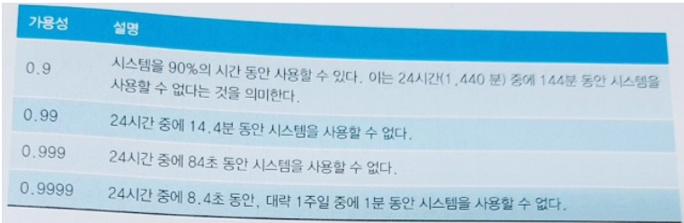

323.p | 그림 11.4 가용성 명세서


가용성

- 가용성 척도 (AVAIL)

- - AVAIL은 서비스에 대한 요구가 있을 때 시스템이 가동중일 확률이다.

✅**기능적 신뢰성 요구사항**

| 기능적 신뢰성 명세 ⭐326.p |                                                              |
| ------------------------- | ------------------------------------------------------------ |
| 검사 요구사항             | 부정확하거나 범위를 벗어난 입력이 시스템에 의해  리되기 전에 감지되는 것을 보장하기 위한 시스템 입력 검사들을 식별한다. |
| 복구 요구사항             | 장애가 생긴 후 시스템 복구를 도와주는 데 맞춰져 있 다. 이러한 요구 사항은 보통 시스템 및 그 데이터의 사본을 관리하고 장애 발생 후 시스템 서비스를 복원하는 방법을 명시하는 것에 관련되어있다. |
| 중복성 요구사항           | 단일 컴포넌트 고장이 서비스의 완전한 손실로 이어지지 않는다는 것을 보장하는 시스템의 중복 기능들을 명시한다 |
| 프로세스 요구사항         | 개발 프로세스에서 좋은 실무 관행이 사용되는 것을 보장하는 결함 회피 요구 사항이다. 명시된 실무 관행은 시스템 장애 횟수를 감소시켜야한다 |

----------

📜**결함내성 아키텍처**

✅**보호 시스템 아키텍쳐 (protection system architecture) ⭐329.p**

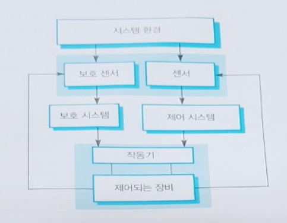

- 보호시스템은 다른 시스템과 관련되는 특별한 시스템이다.

- 보호 시스템은 독립적으로 자신의 환경을 감시한다.

- - 보호 시스템은 제어되는 장치와환경 모두를 감시한다. 
    ​     

- 보호 시스템은 잠재적으로 안전하지 않은 상태에서 안전한 상태로 시스템은 전환하는 데 요구되는 중요한 기능을 포함한다.                                                                                                  

✅**자기점검 아키텍처** 

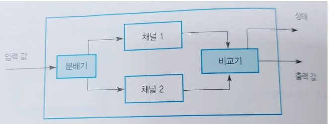

✅ **N버전 프로그래밍**

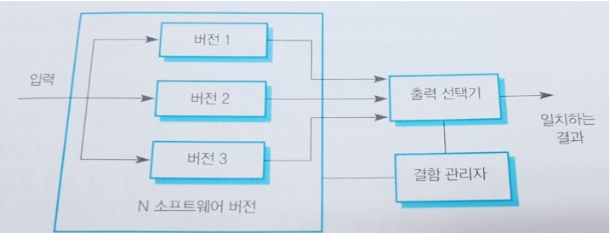

- 삼중 모듈 중복

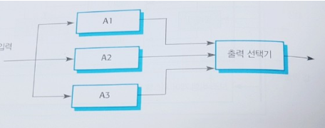

📜📌**결함신뢰성을 위한 프로그래밍 (⭐335.p)**

- 신뢰성 있는 프로그래밍 지침들

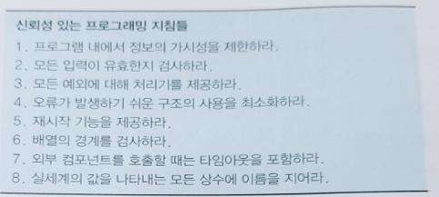

✅ **지침1 : 프로그램 내에서 정보의 가시성을 제한하라.**

✅ **지침2 : 모든 입력이 유효한지 검사하라.**

✅ **지침3 : 모든 예외에 대해 처리기를 제공하라.**

✅ **지침4 : 오류가 발생하기 쉬운 구조의 사용을 최소화하라.**

✅ **지침5 : 재시작 기능을 제공하라.**

✅ **지침6 : 배열의 경계를 검사하라.**

✅ **지침7 : 외부 컴포넌트를 호출할때는 타임아웃을 포함하라.**

✅ **지침8 : 실세계의 값을 나타내는 모든 상수에 이름을 지어라.**


😎**안전성 공학**

📜**안정성 달성**

**✅ Safety Achievement (⭐ 354.p )**

- Hazard avoidance (위험 회피)

- - Hazard  = 위험요인

  - 위험을 피할 수 있도록 시스템을 설계한다.


- Hazard detection and removal (위험 감지 및 제거)

- - 사고가 발생하기 전에 위험을 감지하고 제거할 수 있도록 시스템을 설계한다.


- Damage limitation (손실제한)

- - 시스템은 사고피해를 최소화하는 보호 기능을 포함할 수 있다.

위험 (risk)  = 발생빈도 * 심각도

✅**안전성 달성을 하는데 있어서 2가지 역할**

✅**소프트웨어가 안전하지 않을 수 있는 4가지 이유**


📜**안전성 요구사항**

✅**위험 식별 ⭐328.p**

- 위험 식별 프로세스는 시스템을 위협할 수 있는 위험들을 식별한다. 이러한 위험은 위험 기록부에 기록될 수 있다.

- - 위험 기록부 : 안전성 분석 및 평가를 기록한 공식 문서

📘📌 **Hazard-driven analysis**

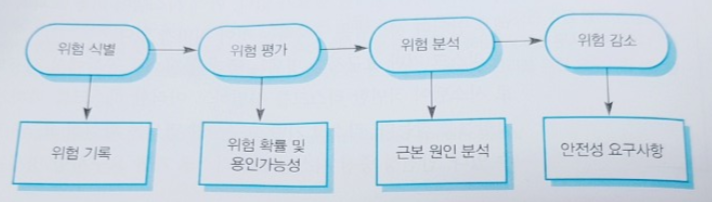

그림 12.2 | 위험주도 요구사항 명세화

- 위험원 식별

- - hazard log

- 위험원 평가 

- - 발생빈도

- 📌 위험원 분석 
  📣 | 시험에 나옵니다.

- - root case 

  - - 📌 FTA 

    - - top down 
      - tree 형태 
      - https://grapevine9700.tistory.com/222

    - 📌 FMEA 

    - - bottom up 
      - 표형태
      - <https://ergonomics.tistory.com/18>

- 안전 대책 (위험 감소)

- - Sw 안전 요구사항

  - - SSRS 4단계

✅**위험 평가**

- 위험 평가 프로세스는 어떤 위험들이 가장 위험한지와 가장 발생 가능성이 높은지를 결정한다. 

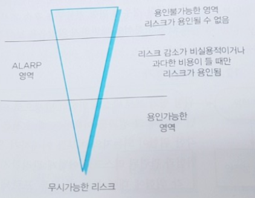

- 위험 평가에 사용되는 3가지 리스크 유형

- - 용인불가능 리스크
  - 일어날 확률이 적은(ALARP) 리스크
  - 용인가능한 리스크


✅**위험 분석**

- 위험의 발생으로 이어질 수 있는 사건들을 식별하는 근본 원인 분석 프로세스이다.

- - 안전성 중심 시스템에서 위험의 근본 원인을 찾는 프로세스이다.

  - 목표 : 위험을 초래할 시스템 고장을 야기하는 사건이나 사건의 조합을 찾는것


- 위험 분해나 분석방법

- - 결함트리분석 기술을 사용

  - - 특징

    - - 전문적인 특정 분야의 지식 없이도 이해하기 상당히 쉽다.
      - 트리의 루트에 위험을 놓고 그 위험에 이를 수 있는 시스템 상태를 찾아낸다. 
      - 각 위험에 대해 그 위험의 가능한 원인을 찾기 위해 역방향으로 작업을 수행한다.

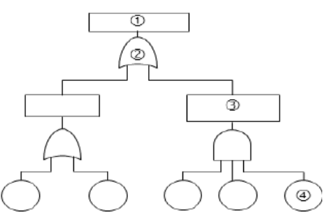

✅**위험 감소(=리스크 감소)**

- 이 프로세스는 위험 분석의 결과에 기초하며 안전성 요구사항의 식별로 이어진다.


😎**보안성 공학**

😎**복원성 공학**


#### 🐱‍👤 Computer Graphics