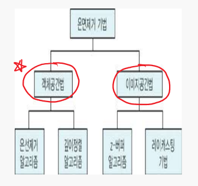

[TOC]


# 11월 4째주

`<b style="background: skyblue"></b>`

## 📌 2019-11-18 Mon

### 📑 Todo_List

* SW-Engineering Team project 소스 개선
  - [x] 모바일 뷰 개선
  - [x] 인스타그램 미리보기 기능 구현

### 📝 Today_Learned

#### <b style="background: skyblue">Javascript event</b>

* *object*.addEventListener(<b style="background:yellow">"mousedown"</b>, *myScript*);
  * 해당 component(=object) 위에서 마우스를 눌렀을때를 감지하는 event다.
* *object*.addEventListener(<b style="background:yellow">"mouseup"</b>, *myScript*);
  - 해당 component(=object) 위에서 마우스를 눌렀다가 땟을때를 감지하는 event다.
* *object*.addEventListener(<b style="background:yellow">"touchstart"</b>, *myScript*);
  * 해당 component(=object) 위에서 손가락으로 눌렀을때(터치했을때)를 감지하는 event다.
* *object*.addEventListener(<b style="background:yellow">"touchend"</b>, *myScript*);
  - 해당 component(=object) 위에서 손가락으로 눌렀다 땟을때를 감지하는 event다.


#### <b style="background: skyblue"> 🐱‍👤Computer Graphics</b>

**3차원 그래픽스 처리 관련 키워드 정리** 

* Translate `위치변환`
* Rotate `회전변환`
* Scale `크기변환`
* modeling `모델링`
* Rendering `렌더링`
* viewing `물체를 바라다 보는것`
* 가시부피 `3차원 공간에서 바라보았을 때의 공간`

* 


**투영=투상 (Projection)**

* 3차원 객체를 2차원 출력장치에 맵핑하는 작업


* **투영 = 가시변환** 

* **투영의 종류**
  * 평행투영 (Patallel)
    * glOrtho( )
  * 원근투영 (Perspective)
    * glPerspective( )


**축측 투영( Axonometric Projection )**

* x,y,z 세 좌표축이 서로 이루는 각도가 모두 같거나 둘만 같거나 모두 다른 특성을 가지는 투영방법이다.

* 직교투영은 투영면이 축과 직각 방향이었지만 축측투영에서는 투영면이 축과 직각이 아닌 방향으로 위치하고 있다.

* 정육면체를 모서리에서 반대쪽 모서리를 행해서 보는 것과 같으며 게임 분야에서는 복잡한 3D 계산을 하지 않고 2D 그래픽만으로 3차원 환경을 쉽게 표현할 수 있으나 원근감을 고려하지 않아 착시현상을 일으키기 쉽다.

* 축측 투영은 x, y, z 세 좌표축이 서로 이루는 각도에 따라 `등각 투영(Isometric Projection)`, `이등각 투영(Dimetric Projection)`, `부등각 투영( Trimetric Projection)`으로 나눌 수 있다. 등각 투영을 2D 전략시뮬레이션 또는 RPG게임에서 광활한 지형을 표현할 때 이용한다.


**원근 투영( Perspective Projection )**

* 시점에서 멀리 떨어져 있는 객체는 작게 투영되고 가까이 있는 객체는 상대적으로 크게 투여이 되어 사람의 눈으로 3차원 사물을 보듯이 보다 현실감 있는 투영 결과를 얻을 수 있는 투영 방법이다.

* 평행 투여오가는 달리 투영선들이 평행을 이루지 않는다. 따라서 투영면에 직각 방향으로 투영이 되지 않는다.

* 평행 투영에서는 투영 방향만 설정하면 되지만 원근 투영에서는 하나의 시점에서 3차원 객체를 바라본 모습이 3차원 투영면에 나타나므로 모튼 투영선이 시점에 모이게 된다.

* 원근 투영은 `소실점( Vanish Point )` 수에 따라 **1점 투영, 2점 투영, 3점 투영** 등으로 나뉘며 이중 1점 투영은 게임에서 많이 이용하는데 1점 투영을 이용해야 물체의 3차원 깊이가 증가함에 따라 투영의 크기가 줄어드는 현상을 나타낼 수 있다.


**소실점( Vanishing Point )**

* 시각 평행선들이 무한이 멀리 있는 하나 또는 여러개의 점으로 모여지는 것을 말한다. 즉 물체의 연장선을 그었을 때 선과 선이 만나는 점을 소실점이라 한다.


**관찰자 위치** 

​	= 카메라 위치 
​	= 투상중심(Center Of Projection)
​	= 시점좌표계 원점


-----------

**카메라의 좌표계 표현**


* <b style="background: yellow">gluLookAt(eyex, eyey, eyez, atx, aty, atz, upx, upy, upz);</b>

* <b style="background: yellow">투상 : void glMatirixMode(GL PROJECTION);</b>

* **가시부피** 
  * 장면의 범위를 지정할 필요성
  * 아래의 두개가 지정이 되면 volume이 지정됩니다.
    * **전방 절단면**
    * **후방 절단면**


-----------------

**Orthographic viewing volume**


**Perspective Projection**


```c++
gluPerspective( 
    GLdouble fovy,     // angle of view 시야각
	GLdouble aspect, // width / height 종횡비
	GLdouble zNear,  // depth of front clip. plane 전방절단면
	GLdouble zFar
    );   // depth of back clip. plane 후방절단면

```

```c++
void glFrustrum(
	Gldouble left,
    Gldouble right,
    Gldouble botttom,
    Gldouble top,
    Gldouble near,
    Gldouble far
)
```


* **<b style="background: pink">정규화 가시부피</b>**
  * 가로, 세로, 높이가 2인 정육면체로 투상
  * 정규화 변환
  * **이유**
    * 평행투상, 원근투상을 동일한 모습의 정규화 가시부피로 변형
    * <b style="background: pink">정육면체를 기준으로 하면 연산이 간단함.</b>
    * 다양한 해상도의 화면 좌표계로 변환하기가 간단함.


---------------

**지엘 파이프라인**


--------------------

**렌더링 (Rendering)**

* 은면제거, 쉐이딩, 텍스쳐 매핑

* 와이어 프레임
  * 드로잉 속도가 빠르다.
  * 가끔씩 솔리드 렌더링으로 외형 확인
* **어파인 공간**
  * 벡터와 벡터의 덧셈 ( 뺄셈 )
  * 스칼라와 벡터의 곱셈 ( 나눗셈 )
  * 점과 벡터의 덧셈 ( 뺄셈 )

## 📌 2019-11-19 Tue

### 📑 Todo_List

- [x] 그래픽스 9장까지 공부
- [ ] Software Engineering 복습
- [x] 자기소개서 작성
- [ ] 인공지능 과제
- [ ] goorm develup 과제 

### 📝 Today_Learned

#### <b style="background: skyblue">🐱‍👤 Computer Graphics</b>

**어파인 공간 affine space**


위 그림에서 점Q에서 점P를 빼면 P에서 Q를 향하는 벡터 V가 된다.
즉, V=Q-P이다. 이것은 Q=V+P로 표현될 수 있고, 이것은 우변은 점 P와 벡터 V의 합이 된다.

**어파인 공간**이란, 이처럼 점을 마치 벡터처럼 취급함으로써 벡터 공간을 확장한 것이다.

어파인 공간에서는 3가지의 연산이 가능하다.

- 벡터와 벡터의 덧셈 ( 뺄셈 )
- 스칼라와 벡터의 곱셈 ( 나눗셈 )
- 점과 벡터의 덧셈 ( 뺄셈 )

-------

**그래픽 변환의종류**


* **강체변환**
  * **이동변환, 회전변환**
  * 물체 자체의 모습은 불변

* **유사변환**

  * **강체변환 + 균등 크기조절 변환, 반사변환**
  * 물체면 사이의 각이 유지됨
  * 물체내부 정점간의 거리가 일정한 비율로 유지됨

* **어파인변환**

  * **유사변환 + 차등 크기조절 변환, 전단변환**
  * 물체의 타입이 유지
    * 직선은 직선으로, 다각형은 다각형으로, 곡면은 곡면으로
    * 평행선이 보존
    * 변환행렬의 마지막 행이 항상 (0,0,0,1)

* **원근변환**

  * 평행선이 만남
  * 직선이 직선으로 유지
  * 변환행렬의 마지막 행이 (0,0,0,1)이 아님

* **선형변환**

  * 어파인 변환 + 원근 변환

  * x' = ax + by + cz

----------------

**모델링**

* 물체를 설계 ( = 물체 정점을 정의 )

**모델 좌표계**

**지역 좌표계**

* **전역 좌표계** : 일률적으로 어우를 수 있는 기준 좌표계 (게임에서의 배경)

**장면** 

* 여러 물체가 존재 ( = 여러 지역 좌표계가 존재 )

**시점변환( = 뷰변환 )**

* 카메라 위치와 방향 설정
* 뷰행렬로 대변됨
* 전역좌표에 뷰행렬을 곱하면 시점좌표
  * **시점좌표계**
    * 물체를 바라다보는 위치

**모델변환**

* 물체에 가해지는 기하변환
* 모델 행렬로 대변됨
* 모델 좌표에 모델 행렬을 곱하면 전역좌표

------------

**행렬모드 설정**

```c++
void glMatirixMode(Glenum mode);
// GL_MODELVIEW
// GL_PROJECTION
// GL_TEXTURE
```

**초기화**

```c++
void glLoadIdentity(); // 항등행렬로 초기화
// 초기화 결과 : 모델 좌표계 -> 전역좌표계 -> 시점 좌표계
```

**기하변환**

```c++
void glTranslatef(GLfloat dx, GLfloat dy, GLfloat dz);
void glScalef(GLfloat sx, GLfloat sy, GLfloat sz);
void glRotatef(GLfloat angle, GLfloat x, GLfloat y, GLfloat z);
```

**함수호출 순서**

glLoadIdentity ➡ glRotatef ➡ glTranslatef ➡ glVertex3f


**시점 좌표계**

```c++
void gluLootAt(
    // 카메라의 위치
	GLdouble eyex,
    GLdouble eyey,
    GLdouble eyez,
	// 카메라가 바라보는 점, 즉 초점의 위치
    GLdouble atx,
    GLdouble aty,
    GLdouble atz,
	// 카메라의 기울임
    GLdouble upx,
    GLdouble upy,
    GLdouble upz
)
```


-----------

**은면 Hidden Surface**

* 시점에서 보이지 않는 면을 제거

**은면제거의 목적**

* 실감있는 이미지를 표현하고, 
  렌더링 처리시간을 단축하여 처리속도의 증대


**벡터**


* **내적 (Dot product)**


* **외적 (Cross product)**

  S X t  =  -t X S


**평면 표현**


-----------

**지엘의 후면제거**

```c++
glEnable(GL_CULL_FACE); // 후면 제거모드 활성화

glCullFace(GL_FRONT); // 실제 후면 제거작업
```

**하나의 면**

*  = 표면(외부) + 이면(내부)

**표면**

```c++
glFrontFace(GL_CW); // 시계방향으로 정의된 면

glFrontFace(GL_CCW); // 반시계방향으로 정의된 면
```

-------------------


**절단(Clipping)**

* 2차원 절단 - 코헨 써더랜드방법
* 3차원 절단
  * 가시부피 이용
* 절단 다각형

**정점의 내외부 판정**

* 두 Vector를 Dot Product한 결과가 양수면 외부, 음수면 내부


**은면제거 알고리즘**



* **객체 공간법**
  * 공간상 객체의 위치관계를 이용하여 은면 결정
    * 공간상의 객체의 위치관계 이용
    * 객체가 적거나 분산되어 존재할 때 가장 효율적
    * 객체가 많아질 경우 은면제거 계산이 복잡
  * 깊이 정렬 알고리즘 등...
* **이미지 공간법**
  * 투영된 픽셀평면에서 객체가 보이는지 여부를 검사
    - **투영면에서 객체의 가시성 여부를 이용**
    - 투영면의 해상도에 따라 처리속도가 좌우
    - 투영면의 각픽셀에 투영되는 객체에 대한 정보를 필요로 하므로 **많은 메모리가 요구**된다.
  * z-버퍼 알고리즘 등


------------


**곡선**

* 알아야할 내용
  * "**베지어 곡선**"과 "**스플라인 곡선**"
  * "**스위핑기법**"
  * "**프랙탈 기하학**"
* 객체 모델링의 개요
  * 다각형면과 2차 곡면을 이용하여 3차원 객체 표현

**삼각형 메쉬**

* 1차 방정식으로 표현됨
* 렌더링이 간단
* **랜덤한 정보에 대하여 가장 많이 사용이 되어진다.**

**사각형 메쉬**

* 보통 2개의 삼각형으로 분할하여 처리

* 또는 평면 방정식을 근사적으로 계산
  * **Ax + By + Cz + D = 0**
  * Ax + By + Cz + D < 0 : **평면의 안쪽**
  * Ax + By + Cz + D > 0 : **평면의 밖쪽**
* **점들이 균일하게 배열되어 있으면 사각형이 적합**

**다면체의 기하적인 정보 표현**

* **꼭지점 표, 모서리 표, 다각형 표**
* **일관성**과 **완전성**이 유지 되어야 함


**커브와 표면 재표현**

* 명시적 방법
* 함축적 방법
* 매개변수 방법


**매개변수 표현방법의 특징**

* 커브가 유연하다.
* 함수로 표현할 필요가 없다.
* 표면에 경우 parameter가 1개가 아니라 2개를 사용한다.


**파라미터 표현**

* **정규화 파라미터**
  * 파라미터의 범위가 (0<=t<=1)

-----------------

**스플라인 곡선**

* 스플라인 = 구간별 다항식으로 구성

* 부드러운 곡선의 모양을 다항식으로 표현
  * 베지어, 비-스플라인
  * 제어점을 지정하여 곡선의 형태를 생성

* **보간곡선과 근사곡선**
  * **보간 :** 주어진 제어점을 통과
  * **근사 :** 제어점을 연결하는 선의 모양에 근사


**스플라인 관련 용어**

* Control Points (제어점)
  * 커브에 영향을 미치는 점의 집합
* InterPolating spline (근사)
  * 제어점 통과 X
  * 부드러움을 위해 제어점을 통과하지 않음
  * 제어점은 곡선을 끌어당기는 역할
* Approximating spline (보간)
  * 제어점 통과 O

**스플라인 정의**

* 구간별로 Curve를 만들어야 함
* 2차 미분값이 같아야 한다.
* 일관적으로 적용되어야 한다.(안정성)
* 랜더링하기 쉬워야 한다


**스플라인의 지역성**

* **직역성(Locality)**
  * 제어점을 움직일 때 여타 구간에 미치는 영향력
  * **이미 설계완료 된 부분에 영향을 미치지 않도록 작을수록 좋음**
  * **구간별로 서로 다른 계수의 다항식**
    * 지역성 향상을 위함

* **곡선의 국부제어**
  * 제어점 하나가 바뀔 때


* 볼록다각형 내포성
  * 곡선은 항상 Convex Hull 내에 포함된다.
  * 곡선의 개괄적인 모양을 파악, 곡선 클리핑에도 이용


**스플라인의 연속성**

* 곡선의 부드러움
  * 제어점 부근에서의 곡선의 기울기와 곡률에 따라 달라진다.
  * 불연속
* C1연속
  * 들어오는 기울기 = 나가는 기울기. 
    기울기 = 접선 = 1차 미분계수
* G1연속
  * 기하학적 또는 시각적 연속성
  * 나가는 기울기가 들어오는 기울기의 상수배, 방향만 같음
* C2연속
  * **들어오는 기울기의 변화율**(= 곡률, 기울기의 기울기, 2차미분계수)
    **= 나가는 기울기의 변화율**.
    가장 부드러운 곡선.
    이를 위해 제어점을 피해갈 수 있음 = **근사 스플라인**

**스플라인 곡선과 연속성**

* 분할된 곡선을 연결하여 하나의 긴 곡선을 설계할 때
* 연결되는 지점에 다양한 연결 조건
  * **C0 연속성**
    * **두 곡선이 단순히 연결**
    * 양쪽 곡선의 좌표값이 동일
  * **C1 연속성**
    * **곡선의 기울기가 동일**
    * 즉, 1차 도함수가 동일
  * **C2 연속성**
    * **양쪽 곡선의 곡률이 동일**
    * 1차 및 2차 도함수가 동일


## 📌 2019-11-20 Wed

### 📑 Todo_List

- [ ] 그래픽스 9장까지 공부
- [x] Computer Network Tutoring
- [x] Software Engineering 복습
- [ ] 자기소개서 완성
- [ ] goorm develup 과제 

### 📝 Today_Learned

#### 🐱‍👤SE

* <a href="./pdf/SE_20191120.pdf">PDF로 작성, 보러가기</a>

#### 🐱‍👤 Computer Graphics

