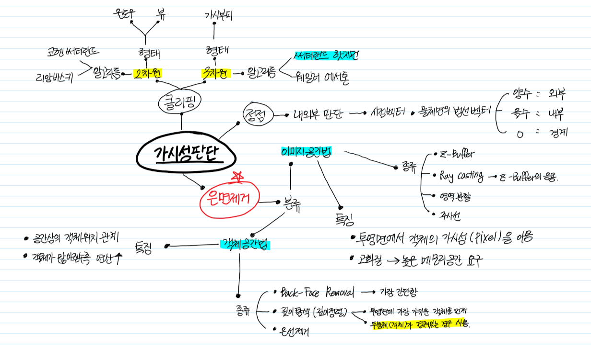

# 📑 목차

[[월] 2019-11-25](#-2019-11-25-월)

[[화] 2019-11-26](#-2019-11-26-화)

[[수] 2019-11-27](#-2019-11-27-수)

[[목] 2019-11-28](#-2019-11-28-목)

[[금] 2019-11-29](#-2019-11-29-금)

[[토] 2019-11-30](#-2019-11-30-토)

[[일] 2019-12-01](#-2019-12-01-일)

# 11월 5째주

## 📆 2019-11-25-월

[목차로 돌아가기](#-목차)

### 📑 Todo_List

- [x] [벤처창업] 소액창업실습
- [x] 교수님과 상담
- [x] 소프트웨어 공학 공부
- [x] 포트폴리오 제출

### 📚 Study

#### 🐱‍👤 벤처창업 실습

* 벤처창업 실습
  * 수익 : 41500

-------

#### 🐱‍👤 SE 

* 기말고사 정리
  * 아키텍처 정리

<a href="./pdf/기말고사 정리.pdf">👉 PDF 정리본 보러가기</a>

---------------

---------

## 📆 2019-11-26-화

[목차로 돌아가기](#-목차)

### 📑 Todo_List

- [x] 그래픽스 공부
- [ ] 그래픽스 팀프로젝트
- [ ] SE 팀플 Product 상세보기 수정
- [ ] SE 팀플 발표자료 수정

### 📚 Study

#### 🐱‍👤 Graphics 

* **Chapter 9. 가시성판단**

* **Chapter 10. 음영과 조명**

**음영 종류**

* **플랫 쉐이딩**
  * 빠르고 간단
* **구로 쉐이딩**
  * 점점의 색을 보간
  * 경면반사 X
* **퐁 쉐이딩** (구로에서 응용)
  * 두 벡터 를 보간
  * 경면반사 O

**조명**

* **간접 조명 모델**
  * 주변광 Ambient (Ka)
* **직접 조명 모델**
  * 확산광
  * 난반사광 (Kd)
  * 경면광 (유리표면) (Ks) 

* **빛의 세기**

  * 거리제곱에 반비례
  * Ia(광원의 주변광 세기), Id, Is 
    * **Ambient Reflections(주변반사)** = (Ka * Ia) / (D * D)

* **반사**

  * **확산반사**

    *  = 난반사

    * Id = Kd * Ld * cosθ = Kd * Ld * (LㆍN)

      Ld : 광원의 강도
      L : 빛이 들어오는 벡터
      N : 법선 벡터
      Id : 광원의 확산광 세기

    * 서 있는 방향에 따라 다름

    * 입체감 부여

  * **경면반사**

    * 정반사에 의함
    * 물체의 색 X, 광원의 색 O
    * Is = Ks * Ld * cosθ
    * 퐁반사에서 사용

------

#### 🐱‍👤 제목 2

------

------------

## 📆 2019-11-27-수

[목차로 돌아가기](#-목차)

### 📑 Todo_List

- [x] 그래픽스 팀프로젝트
- [ ] 그래픽스 공부
- [ ] 소프트웨어 공학 복습

### 📚 Study

#### 🐱‍👤 제목 1

------

#### 🐱‍👤 제목 2

------

-----------

## 📆 2019-11-28-목

[목차로 돌아가기](#-목차)

### 📑 Todo_List

- [x] 항목 1
- [ ] 항목 2
- [ ] 항목 3

### 📚 Study

#### 🐱‍👤 제목 1

------

#### 🐱‍👤 제목 2

------

-------------

## 📆 2019-11-29-금

[목차로 돌아가기](#-목차)

### 📑 Todo_List

- [x] 항목 1
- [ ] 항목 2
- [ ] 항목 3

### 📚 Study

#### 🐱‍👤 제목 1

------

#### 🐱‍👤 제목 2

------

--------------

## 📆 2019-11-30-토

[목차로 돌아가기](#-목차)

### 📑 Todo_List

- [x] 항목 1
- [ ] 항목 2
- [ ] 항목 3

### 📚 Study

#### 🐱‍👤 제목 1

------

#### 🐱‍👤 제목 2

------

--------------

## 📆 2019-12-01-일

[목차로 돌아가기](#-목차)

### 📑 Todo_List

- [x] 항목 1
- [ ] 항목 2
- [ ] 항목 3

### 📚 Study

#### 🐱‍👤 제목 1

------

#### 🐱‍👤 제목 2

------

--------------

-----------

